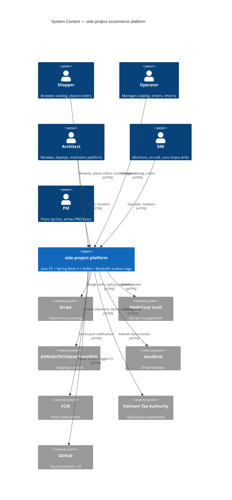
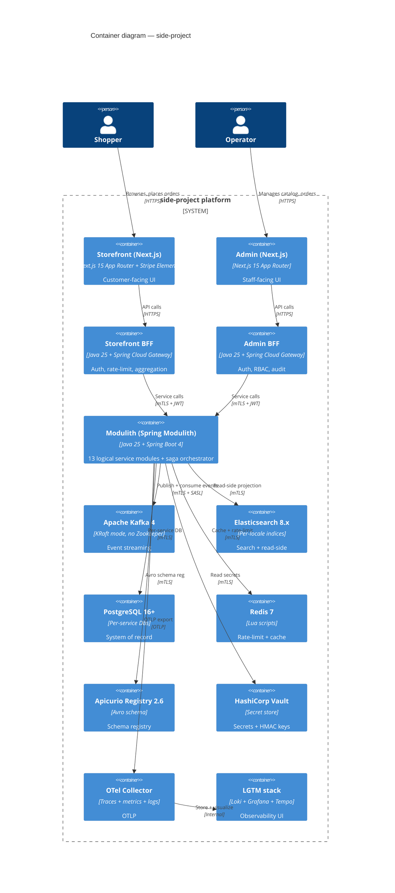
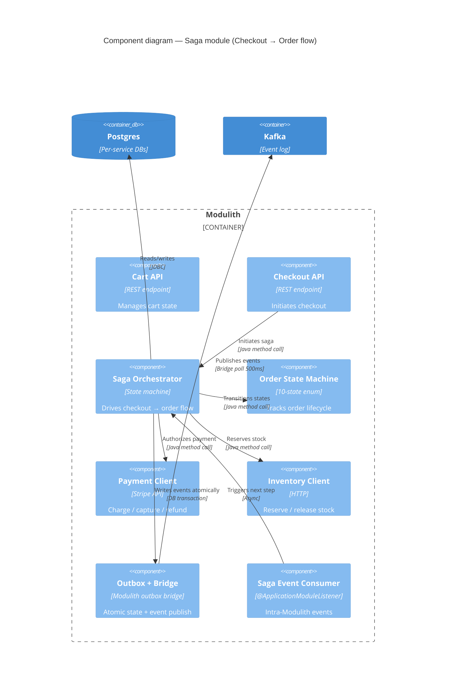
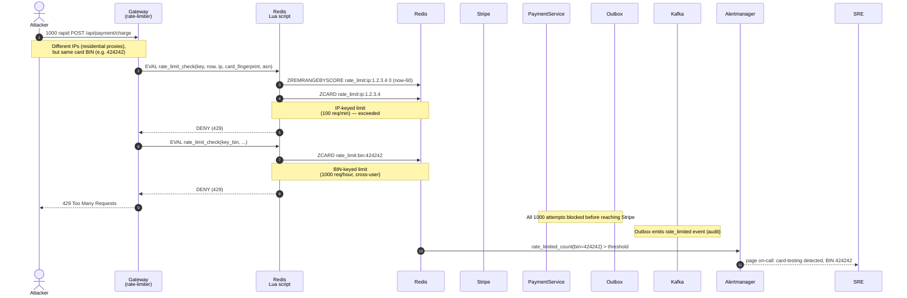
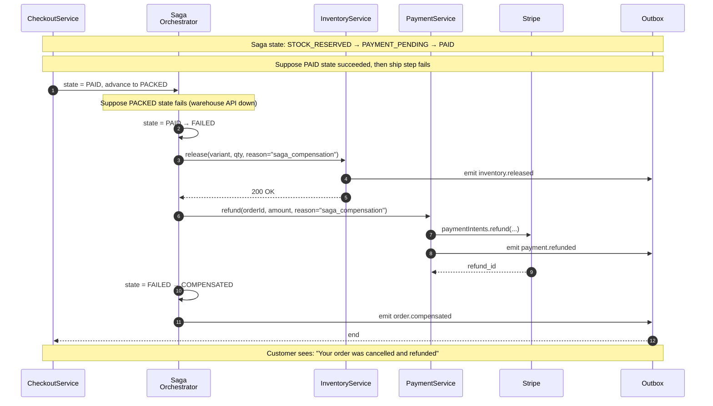
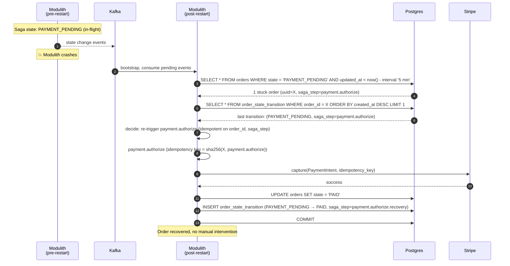
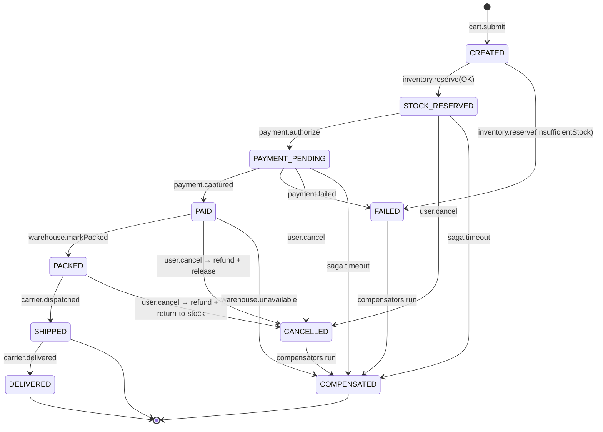
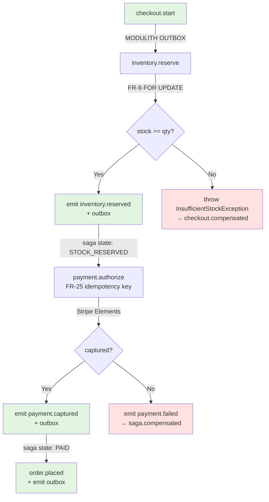

# Architecture Diagrams — side-project

> **Source:** `architecture.md` + `architecture-detail.md` (textual). This file is the **visual companion** — C4 + sequence diagrams.
> **Format:** Mermaid (text-based, version-controllable). Render in VS Code, GitHub, mermaid.live.
> **Where these go in canonical:** C4 System Context → `architecture.md` §"Project Structure". Sequence diagrams → corresponding ADR's Detail section.

---

## 1. C4 — System Context (Level 1)

The whole system + its external actors.



---

## 2. C4 — Container (Level 2)

Inside the system: services, BFFs, frontend, infrastructure.



---

## 3. C4 — Component (Level 3) — Saga Module (per ADR-01 + ADR-12)

Inside the Modulith, focusing on the saga component.



---

## 4. Sequence — Place an order (happy path)

```mermaid
sequenceDiagram
    autonumber
    actor Customer
    participant SF as Storefront<br/>(Next.js)
    participant BFF as Storefront BFF
    participant Chk as CheckoutService
    participant Saga as Saga<br/>Orchestrator
    participant Pay as PaymentService
    participant Stripe
    participant Inv as InventoryService
    participant DB as Postgres<br/>(per-service)
    participant OB as Outbox
    participant Bridge as Outbox<br/>Bridge
    participant K as Kafka

    Customer->>SF: POST /bff/storefront/checkout {cartId, address}
    SF->>BFF: forward with session cookie
    BFF->>Chk: checkout.start(cartId, address)
    Chk->>DB: BEGIN; INSERT checkout
    Chk->>OB: INSERT checkout.started
    Chk-->>BFF: {checkoutId, state: CREATED, stripeClientSecret}
    BFF-->>SF: 201 {checkoutId}
    SF-->>Customer: Show Stripe Elements iframe

    Customer->>Stripe: Enter card details (iframe)
    Stripe->>BFF: Webhook payment_intent.succeeded
    BFF->>Pay: handleWebhook(event.id, event.type)
    Pay->>DB: SELECT * FROM webhook_dedup WHERE event_id = ? (no row → new)
    Pay->>Stripe: Confirm PaymentIntent
    Pay->>DB: BEGIN; INSERT payment {stripe_id, amount}; UPDATE webhook_dedup
    Pay->>OB: INSERT payment.captured
    Pay-->>BFF: 200 OK
    BFF-->>Stripe: 200 OK

    Bridge->>OB: Poll unpublished rows every 500ms
    OB-->>Bridge: 1 row (payment.captured)
    Bridge->>K: publish to topic payment.captured (HMAC-signed)

    K->>Saga: payment.captured event
    Saga->>Saga: state: PAYMENT_PENDING → PAID
    Saga->>DB: BEGIN; INSERT order_state_transition; UPDATE orders.state
    Saga->>OB: INSERT order.placed
    Saga->>Bridge: poll + publish order.placed
    Bridge->>K: publish to topic orders.placed

    K->>Inv: orders.placed (reserves stock again — re-validates after capture)
    Inv->>DB: SELECT FOR UPDATE on variant row
    Inv->>DB: UPDATE inventory_ledger (release reservation)
    Inv-->>K: ack

    Customer->>SF: GET /bff/storefront/checkout/{id}
    SF->>BFF: forward
    BFF->>Chk: getStatus(checkoutId)
    Chk-->>BFF: {state: PAID, orderId: ...}
    BFF-->>SF: 200
    SF-->>Customer: Redirect to /orders/{orderId}
```

---

## 5. Sequence — Card testing defense (R-05 / ADR-24)



---

## 6. Sequence — Inventory oversell defense (R-02 / DI-01)

```mermaid
sequenceDiagram
    autonumber
    actor CustomerA
    actor CustomerB
    participant Chk as CheckoutService
    participant Inv as InventoryService
    participant DB as Postgres

    Note over DB: Variant X, on_hand = 1<br/>(2 concurrent checkouts)

    par Concurrent checkouts
        CustomerA->>Chk: POST /bff/storefront/checkout (qty 1)
        CustomerB->>Chk: POST /bff/storefront/checkout (qty 1)
    end

    Chk->>Inv: reserve(variant=X, qty=1, saga_step="payment")
    Inv->>DB: BEGIN; SELECT * FROM variants WHERE id=X FOR UPDATE
    Note over DB: Lock acquired (CustomerA's tx)
    Inv->>DB: SELECT on_hand FROM inventory_on_hand WHERE variant=X
    Note over DB: Returns 1 (sufficient)
    Inv->>DB: INSERT inventory_ledger (-1, reason='reservation')
    Inv->>DB: INSERT reservations (qty=1, expires_at=now()+15min)
    Inv->>DB: COMMIT
    Inv-->>Chk: 201 {reservationId}

    Chk->>Inv: reserve(variant=X, qty=1, saga_step="payment")
    Inv->>DB: BEGIN; SELECT * FROM variants WHERE id=X FOR UPDATE
    Note over DB: Blocks — CustomerA's lock still held
    Note over DB: Eventually CustomerA's tx commits
    Note over DB: CustomerB's tx now proceeds
    DB-->>Inv: on_hand = 1 - 1 = 0
    Inv-->>Chk: 409 InsufficientStockException

    Chk-->>CustomerB: 409 Out of stock
```

---

## 7. Sequence — Event injection defense (R-XX / AT-03 / ADR-20)

```mermaid
sequenceDiagram
    autonumber
    participant Attacker as Attacker<br/>(compromised pod)
    participant K as Kafka
    participant Cons as Consumer<br/>(e.g., Inventory)
    participant Hmac as HmacVerifier

    Attacker->>K: publish to catalog.product.created
    Note over Attacker,K: Spoofed event with bad signature

    K->>Cons: deliver event
    Cons->>Hmac: verify(event.signatures.hmac_sha256, payload)
    Hmac->>Hmac: lookup Vault secret for "catalog-service"
    Hmac->>Hmac: compute HMAC-SHA256(canonical_json(payload), secret)
    Note over Hmac: constant_time_compare
    Note over Hmac: signatures do NOT match
    Hmac-->>Cons: throw InvalidEventSignatureException

    Cons->>Cons: emit security alert: hmec_validation_failures_total
    Cons-->>K: ack (don't requeue)

    Note over Cons: Bad event rejected; legitimate events still flow
```

---

## 8. Sequence — Vietnamese tax-invoice (R-06 / LC-03 / ADR-26 + Q5 closure)

```mermaid
sequenceDiagram
    autonumber
    actor Customer
    participant Ord as OrderService
    participant Inv as InvoiceService
    participant DB as Postgres
    participant Vault as HashiCorp Vault
    participant Jasper as Jasper<br/>Engine
    participant QR as QRCodeUtil
    participant Batch as Daily<br/>Batch (Quartz)
    participant Auth as Vietnam<br/>Tax Authority

    Note over Inv,DB: Startup check: credentials row exists?
    Inv->>DB: SELECT * FROM vietnam_tax_authority_credential WHERE active_until > today
    DB-->>Inv: 1 row found
    Note over Inv: OK to start

    Customer->>Ord: Order paid (post-saga)
    Ord->>Inv: emitInvoice(orderId, amount)
    Inv->>DB: BEGIN; SELECT * FROM tax_invoice_sequence FOR UPDATE
    Inv->>DB: UPDATE tax_invoice_sequence SET current_value = current_value + 1
    Inv->>DB: INSERT INTO invoices (tax_invoice_id, amount, pdf_path, qr_data)
    Inv->>DB: COMMIT

    Inv->>Vault: read secret tax/<merchant_tax_code>/tax_authority_token
    Vault-->>Inv: <encrypted token>
    Inv->>Jasper: render(invoice_template, data)
    Jasper-->>Inv: PDF bytes
    Inv->>QR: generate(merchant_tax_code, tax_invoice_id, amount)
    QR-->>Inv: QR data
    Inv->>DB: UPDATE invoices SET pdf_path = ..., qr_data = ...
    Inv-->>Ord: {invoice_id, tax_invoice_id, pdf_url}

    Note over Batch: Daily 23:00 cron
    Batch->>DB: SELECT * FROM invoices WHERE issued_at::date = today
    Batch->>Auth: POST /api/v1/invoices (with tax_authority_token)
    Auth-->>Batch: 200 OK (invoice registered)
```

---

## 9. Sequence — Saga compensation (any failure mid-saga)



---

## 10. Sequence — Crash recovery (saga stuck on Modulith restart)



---

## 11. State diagram — Order state machine (per ADR-12)



---

## 12. Architecture decision flow (per ADR-01 — Modulith outbox saga)



Legend: 🟢 = happy path / 🟥 = failure / compensation path

---

## 13. Data flow — Outbox + Kafka + consumer (per ADR-04 + ADR-14)

```mermaid
flowchart LR
    subgraph Service A
        A1[business logic] --> A2[begin transaction]
        A2 --> A3[update business state]
        A3 --> A4[insert outbox row]
        A4 --> A5[commit transaction]
    end

    A5 -->|atomic| DB1[(Service A's DB<br/>outbox table)]
    DB1 -.->|poll every 500ms| Bridge[Modulith outbox bridge]

    subgraph Kafka
        K[(Kafka topic)]
    end

    Bridge -->|publish w/ HMAC| K

    K -->|subscribe| B1[Service B consumer<br/>@ApplicationModuleListener or @KafkaListener]
    B1 --> B2[verify HMAC signature<br/>FR-82 / ADR-20]
    B2 -->|valid| B3[check processed_event<br/>FR-26 dedup]
    B3 -->|new event| B4[process business logic]
    B3 -->|duplicate| B5[ack and skip]
    B4 --> B6[commit + insert processed_event]
```



---

## 14. Per-locale ES index pattern (per architecture "Elasticsearch read-side")

```mermaid
flowchart TB
    subgraph Postgres
        P1[catalog.products]
    end

    subgraph Modulith outbox bridge
        OB[bridge]
    end

    subgraph ES
        E1[catalog_vi_prod<br/>analyzer: vi_text]
        E2[catalog_en_prod<br/>analyzer: en]
        E3[catalog_search<br/>(read alias)]
    end

    P1 -->|CDC| OB
    OB -->|write| E1
    OB -->|write| E2
    E1 -->|alias| E3
    E2 -->|alias| E3

    Client[Search query] -->|GET catalog_search/_search| E3
    E3 -->|results| Client
```

---

## 15. How to render these

### Local (VS Code)

```bash
# Install Markdown Preview Mermaid Support extension
# Or use Mermaid Preview in VS Code
```

### Online

- https://mermaid.live (paste and render)
- https://mermaid.ink (URL-based image generation)

### In Markdown viewers

GitHub, GitLab, Bitbucket render Mermaid natively in Markdown files.

### As images for docs

```bash
# Install mmdc (Mermaid CLI)
npm install -g @mermaid-js/mermaid-cli

# Render to PNG
mmdc -i ARCHITECTURE-DIAGRAMS.md -o diagrams/
```

---

## 16. Where each diagram goes in canonical docs

| Diagram | Goes in |
|---|---|
| §1 C4 System Context | `architecture.md` §"Project Structure" intro |
| §2 C4 Container | `architecture.md` §"Project Structure" |
| §3 C4 Component (Saga) | `architecture-detail.md` §"Detail: ADR-01" |
| §4 Sequence (Place order) | `architecture-detail.md` §"Detail: ADR-04" + Epic 4 docs |
| §5 Sequence (Card testing) | `architecture-detail.md` §"Detail: ADR-24" |
| §6 Sequence (Oversell) | `architecture-detail.md` §"Saga state storage" |
| §7 Sequence (Event injection) | `architecture-detail.md` §"Detail: ADR-20" |
| §8 Sequence (Tax-invoice) | `architecture-detail.md` §"Detail: ADR-26" |
| §9 Sequence (Compensation) | `architecture-detail.md` §"Detail: ADR-12" |
| §10 Sequence (Crash recovery) | `architecture-detail.md` §"Detail: ADR-12" + §"Detail: ADR-01" |
| §11 State machine | `architecture-detail.md` §"Detail: ADR-12" |
| §12 Architecture flow | `architecture.md` §"Detail: ADR-01" |
| §13 Data flow (Outbox) | `architecture-detail.md` §"Detail: ADR-04" |
| §14 ES per-locale | `architecture-detail.md` §"Detail: ADR-04" → "Elasticsearch read-side" |

---

## 17. Cross-references

- **Architecture (textual):** `architecture.md`
- **Per-ADR detail:** `architecture-detail.md`
- **Domain boundaries:** `PROBLEM-DOMAINS-MAP.md`
- **Event catalog (full list):** `PROBLEM-DOMAINS-MAP.md` §5
- **Risk binding:** `RISK-REGISTER.md`
- **Sprint work (implementing these flows):** `SPRINT-1-DEV-HANDBOOK.md` + `EPIC-1-STORIES-QUICKREF.md`
- **Story automator:** `STORY-AUTOMATOR-CHEATSHEET.md`
- **Onboarding:** `AGENT-ONBOARDING.md`
- **Glossary:** `GLOSSARY.md`
