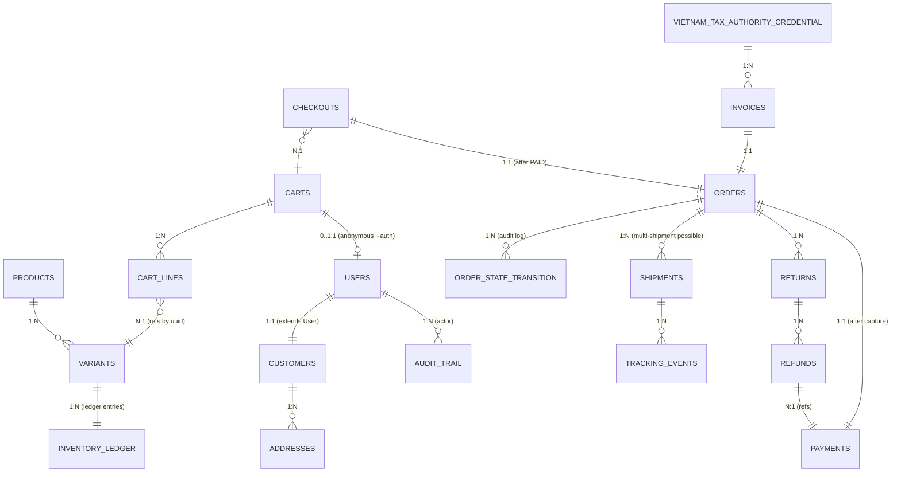

# Data Model — side-project

> **Principle (per ADR-03):** Per-service database. NO cross-service JOINs. Cross-service references by aggregate ID only.
> **Convention:** All tables have `id BIGSERIAL PRIMARY KEY` (auto-increment) + `uuid BIGINT UNIQUE` (Snowflake distributed ID, for cross-service refs). All inherit `BaseEntity` (per util) which adds `created_at`, `updated_at`, `created_by`, `updated_by`, `is_active`, `is_deleted`, `deleted_at`, `deleted_by`.

---

## 1. Database landscape (per-service)

| Service | Database | # tables | Key tables | User-facing data? |
|---|---|---|---|---|
| catalog | `catalog_dev` | 5 | products, variants, attributes | Yes (catalog read) |
| inventory | `inventory_dev` | 5 | inventory_ledger, reservations | No (internal) |
| cart | `cart_dev` | 3 | cart, cart_lines | Yes (cart read) |
| checkout | `checkout_dev` | 2 | checkouts | No (transient) |
| payment | `payment_dev` | 3 | payments, webhook_dedup | No (sensitive) |
| order | `order_dev` | 4 | orders, order_state_transition | Yes (order read) |
| fulfillment | `fulfillment_dev` | 3 | shipments, tracking_events | Yes (tracking) |
| returns | `returns_dev` | 3 | returns, refunds | Yes (history) |
| customer | `customer_dev` | 6 | customers, addresses, users, customer_data_registry, audit_trail | Yes (PDPD-sensitive) |
| search | `search_dev` | 1 | outbox, processed_event | No (projection to ES) |
| notification | `notification_dev` | 3 | notification_log, templates, preferences | No (transient) |
| admin | `admin_dev` | 2 | approval_workflows, audit_trail_refs | No (admin only) |
| pricing | `pricing_dev` | 2 | price_table, coupons | No (stateless) |
| invoice | `invoice_dev` | 3 | tax_invoice_sequence, vietnam_tax_authority_credential, invoices | No (compliance) |

**Total: 14 services, ~45 tables.** Average 3 tables per service — keeps schemas small and focused.

---

## 2. Entity-relationship overview



---

## 3. Per-service schema (high-level)

### Catalog service

```sql
-- products: aggregate root
CREATE TABLE products (
    id BIGSERIAL PRIMARY KEY,
    uuid BIGINT NOT NULL UNIQUE,  -- Snowflake ID for cross-service refs
    name VARCHAR(200) NOT NULL,
    slug VARCHAR(100) NOT NULL UNIQUE,
    brand VARCHAR(100),
    category VARCHAR(100),
    description TEXT,
    image_set JSONB,  -- {"main": "...", "thumbs": ["..."]}
    is_active BOOLEAN NOT NULL DEFAULT true,
    is_deleted BOOLEAN NOT NULL DEFAULT false,
    deleted_at TIMESTAMP,
    deleted_by VARCHAR(36),
    created_at TIMESTAMP NOT NULL DEFAULT now(),
    created_by VARCHAR(36) NOT NULL,
    updated_at TIMESTAMP,
    updated_by VARCHAR(36)
    -- Inherits audit fields from BaseEntity
);

-- variants: per-SKU stock unit
CREATE TABLE variants (
    id BIGSERIAL PRIMARY KEY,
    uuid BIGINT NOT NULL UNIQUE,  -- Snowflake ID
    product_id BIGINT NOT NULL REFERENCES products(id),
    sku VARCHAR(64) NOT NULL UNIQUE,  -- hash(product_id + attrs)
    attributes_json JSONB NOT NULL,  -- {"color": "red", "size": "M"}
    price_list_cents BIGINT NOT NULL,  -- stored in VND cents
    price_sale_cents BIGINT,
    weight_grams INT,
    is_active BOOLEAN NOT NULL DEFAULT true,
    is_deleted BOOLEAN NOT NULL DEFAULT false,
    created_at TIMESTAMP NOT NULL DEFAULT now(),
    updated_at TIMESTAMP
);
CREATE INDEX idx_variants_product ON variants(product_id) WHERE NOT is_deleted;

-- attributes: catalog attribute metadata (admin-defined)
CREATE TABLE attributes (
    id BIGSERIAL PRIMARY KEY,
    name VARCHAR(50) NOT NULL UNIQUE,  -- "color", "size"
    display_name_vi VARCHAR(100),
    display_name_en VARCHAR(100),
    value_type VARCHAR(20) NOT NULL,  -- 'enum' | 'number' | 'string'
    allowed_values JSONB,  -- for enum
    sort_order INT
);

-- outbox (per-service, canonical pattern)
CREATE TABLE outbox (
    id BIGSERIAL PRIMARY KEY,
    event_id BIGINT NOT NULL UNIQUE,  -- Snowflake ID
    aggregate_type VARCHAR(50) NOT NULL,  -- 'product'
    aggregate_id BIGINT NOT NULL,
    event_type VARCHAR(100) NOT NULL,  -- 'catalog.product.created'
    payload JSONB NOT NULL,
    published_at TIMESTAMP,
    created_at TIMESTAMP NOT NULL DEFAULT now()
);
CREATE INDEX idx_outbox_unpublished ON outbox(created_at) WHERE published_at IS NULL;

-- processed_event (consumer dedup)
CREATE TABLE processed_event (
    event_id BIGINT PRIMARY KEY,
    consumer_name VARCHAR(100) NOT NULL,
    processed_at TIMESTAMP NOT NULL DEFAULT now(),
    PRIMARY KEY (event_id, consumer_name)
);
```

### Inventory service

```sql
-- inventory_ledger: double-entry ledger
CREATE TABLE inventory_ledger (
    id BIGSERIAL PRIMARY KEY,
    variant_uuid BIGINT NOT NULL,  -- refs catalog.variants.uuid
    warehouse_id VARCHAR(50) NOT NULL,
    delta BIGINT NOT NULL,  -- +receive, -release
    reason VARCHAR(50) NOT NULL,  -- 'reservation'|'allocation'|'shipment'|'adjustment'|'release'
    event_id BIGINT,
    created_at TIMESTAMP NOT NULL DEFAULT now()
);
CREATE INDEX idx_ledger_variant_wh ON inventory_ledger(variant_uuid, warehouse_id);

-- inventory_on_hand: sum-derivation view
CREATE VIEW inventory_on_hand AS
    SELECT variant_uuid, warehouse_id, SUM(delta) AS on_hand
    FROM inventory_ledger
    GROUP BY variant_uuid, warehouse_id;

-- reservations: TTL-bound stock holds
CREATE TABLE reservations (
    id BIGSERIAL PRIMARY KEY,
    uuid BIGINT NOT NULL UNIQUE,  -- Snowflake ID
    variant_uuid BIGINT NOT NULL,
    warehouse_id VARCHAR(50) NOT NULL,
    qty BIGINT NOT NULL,
    saga_step_id VARCHAR(100) NOT NULL,  -- 'checkout-payment'
    expires_at TIMESTAMP NOT NULL,
    released_at TIMESTAMP,
    created_at TIMESTAMP NOT NULL DEFAULT now(),
    is_active BOOLEAN NOT NULL DEFAULT true
);
CREATE INDEX idx_reservations_expiry ON reservations(expires_at) WHERE released_at IS NULL;
```

### Customer service

```sql
-- users: auth principal
CREATE TABLE users (
    id BIGSERIAL PRIMARY KEY,
    uuid BIGINT NOT NULL UNIQUE,  -- Snowflake ID
    email VARCHAR(255) NOT NULL UNIQUE,
    password_hash VARCHAR(255) NOT NULL,  -- Argon2id
    role VARCHAR(20) NOT NULL,  -- 'customer'|'staff'|'admin'|'service-account'
    mfa_secret VARCHAR(255),  -- TOTP secret (if MFA enabled)
    failed_login_count INT NOT NULL DEFAULT 0,
    locked_until TIMESTAMP,
    email_verified_at TIMESTAMP,
    last_login_at TIMESTAMP,
    is_active BOOLEAN NOT NULL DEFAULT true,
    is_deleted BOOLEAN NOT NULL DEFAULT false,  -- per R2F
    deleted_at TIMESTAMP,
    created_at TIMESTAMP NOT NULL DEFAULT now(),
    created_by VARCHAR(36) NOT NULL,
    updated_at TIMESTAMP,
    updated_by VARCHAR(36)
);
CREATE INDEX idx_users_email ON users(email) WHERE NOT is_deleted;

-- customers: extends User with commerce profile
CREATE TABLE customers (
    id BIGSERIAL PRIMARY KEY,
    user_id BIGINT NOT NULL UNIQUE REFERENCES users(id),
    display_name VARCHAR(200),
    loyalty_points BIGINT NOT NULL DEFAULT 0,
    preferred_locale VARCHAR(5) NOT NULL DEFAULT 'vi',
    is_active BOOLEAN NOT NULL DEFAULT true,
    is_deleted BOOLEAN NOT NULL DEFAULT false,
    created_at TIMESTAMP NOT NULL DEFAULT now(),
    updated_at TIMESTAMP
);

-- addresses: per-customer shipping/billing
CREATE TABLE addresses (
    id BIGSERIAL PRIMARY KEY,
    uuid BIGINT NOT NULL UNIQUE,  -- Snowflake ID
    customer_id BIGINT NOT NULL REFERENCES customers(id),
    recipient_name VARCHAR(200) NOT NULL,
    phone VARCHAR(20) NOT NULL,
    province VARCHAR(50) NOT NULL,  -- From util ProvinceDto
    district VARCHAR(50) NOT NULL,  -- From util DistrictDto
    commune VARCHAR(50) NOT NULL,  -- From util CommuneDto
    street VARCHAR(255) NOT NULL,
    postal_code VARCHAR(20),
    is_default BOOLEAN NOT NULL DEFAULT false,
    is_deleted BOOLEAN NOT NULL DEFAULT false,
    created_at TIMESTAMP NOT NULL DEFAULT now()
);
CREATE INDEX idx_addresses_customer ON addresses(customer_id) WHERE NOT is_deleted;

-- customer_data_registry: PDPD export source-of-truth (per FR-46)
CREATE TABLE customer_data_registry (
    id BIGSERIAL PRIMARY KEY,
    service VARCHAR(50) NOT NULL,
    table_name VARCHAR(100) NOT NULL,
    columns JSONB NOT NULL,  -- which fields are customer PII
    export_format VARCHAR(20) NOT NULL,  -- 'json' | 'csv'
    retention_days INT,
    UNIQUE(service, table_name)
);

-- audit_trail: admin mutations + sensitive actions
CREATE TABLE audit_trail (
    id BIGSERIAL PRIMARY KEY,
    actor_id UUID NOT NULL,
    actor_role VARCHAR(20) NOT NULL,
    action VARCHAR(100) NOT NULL,
    resource_type VARCHAR(50) NOT NULL,
    resource_id UUID,
    before_state JSONB,
    after_state JSONB,
    diff JSONB,
    request_id UUID,
    trace_id VARCHAR(32),
    created_at TIMESTAMP NOT NULL DEFAULT now()
);
CREATE INDEX idx_audit_actor ON audit_trail(actor_id, created_at);
CREATE INDEX idx_audit_resource ON audit_trail(resource_type, resource_id);
```

### Order service

```sql
-- orders: aggregate root
CREATE TABLE orders (
    id BIGSERIAL PRIMARY KEY,
    uuid BIGINT NOT NULL UNIQUE,  -- Snowflake ID, cross-service ref
    customer_uuid BIGINT NOT NULL,  -- refs customer.customers.uuid
    state VARCHAR(20) NOT NULL,  -- 'CREATED'|'STOCK_RESERVED'|'PAYMENT_PENDING'|'PAID'|'PACKED'|'SHIPPED'|'DELIVERED'|'CANCELLED'|'FAILED'|'COMPENSATED'
    version BIGINT NOT NULL DEFAULT 0,  -- optimistic concurrency
    price_snapshot_cents BIGINT NOT NULL,
    tax_cents BIGINT NOT NULL DEFAULT 0,
    shipping_cents BIGINT NOT NULL DEFAULT 0,
    total_cents BIGINT NOT NULL,
    shipping_address JSONB NOT NULL,  -- denormalized snapshot
    billing_address JSONB,
    is_deleted BOOLEAN NOT NULL DEFAULT false,
    created_at TIMESTAMP NOT NULL DEFAULT now(),
    updated_at TIMESTAMP
);

-- order_lines: snapshot at order time
CREATE TABLE order_lines (
    id BIGSERIAL PRIMARY KEY,
    order_id BIGINT NOT NULL REFERENCES orders(id),
    variant_uuid BIGINT NOT NULL,  -- refs catalog
    product_name VARCHAR(200) NOT NULL,  -- snapshot
    sku VARCHAR(64) NOT NULL,  -- snapshot
    qty BIGINT NOT NULL,
    unit_price_cents BIGINT NOT NULL,  -- snapshot
    line_total_cents BIGINT NOT NULL  -- snapshot
);

-- order_state_transition: state machine log (per ADR-12)
CREATE TABLE order_state_transition (
    id BIGSERIAL PRIMARY KEY,
    order_id BIGINT NOT NULL REFERENCES orders(id),
    from_state VARCHAR(20),
    to_state VARCHAR(20) NOT NULL,
    saga_step VARCHAR(100) NOT NULL,  -- 'payment.authorize'
    event_id BIGINT,
    created_at TIMESTAMP NOT NULL DEFAULT now()
);
CREATE INDEX idx_ost_order ON order_state_transition(order_id, created_at);
```

### Payment service

```sql
-- payments: aggregate
CREATE TABLE payments (
    id BIGSERIAL PRIMARY KEY,
    uuid BIGINT NOT NULL UNIQUE,  -- Snowflake ID
    order_uuid BIGINT NOT NULL,  -- refs order.orders.uuid
    stripe_payment_intent_id VARCHAR(64) NOT NULL UNIQUE,
    amount_cents BIGINT NOT NULL,
    currency VARCHAR(3) NOT NULL DEFAULT 'VND',
    status VARCHAR(20) NOT NULL,  -- 'pending'|'succeeded'|'failed'|'refunded'|'disputed'
    captured_at TIMESTAMP,
    created_at TIMESTAMP NOT NULL DEFAULT now(),
    updated_at TIMESTAMP
);

-- webhook_dedup: R-03 mitigation (per FR-26)
CREATE TABLE webhook_dedup (
    stripe_event_id VARCHAR(64) PRIMARY KEY,
    event_type VARCHAR(100) NOT NULL,
    received_at TIMESTAMP NOT NULL DEFAULT now()
);
```

### Invoice service

```sql
-- vietnam_tax_authority_credential: Q5 closure (per ADR-26)
CREATE TABLE vietnam_tax_authority_credential (
    id BIGSERIAL PRIMARY KEY,
    merchant_tax_code VARCHAR(14) NOT NULL UNIQUE,  -- MST
    merchant_name VARCHAR(255) NOT NULL,
    merchant_address VARCHAR(512) NOT NULL,
    serial_prefix VARCHAR(2) NOT NULL,
    serial_number_start BIGINT NOT NULL,
    serial_number_end BIGINT NOT NULL,
    tax_authority_api VARCHAR(255) NOT NULL,
    tax_authority_token TEXT NOT NULL,  -- encrypted
    invoice_template_id VARCHAR(64),
    active_from DATE NOT NULL,
    active_until DATE,
    created_at TIMESTAMP NOT NULL DEFAULT now(),
    created_by VARCHAR(36) NOT NULL,
    reviewed_at TIMESTAMP,
    reviewed_by VARCHAR(36),
    notes TEXT
);

-- tax_invoice_sequence: serial number allocator
CREATE TABLE tax_invoice_sequence (
    id BIGSERIAL PRIMARY KEY,
    merchant_tax_code VARCHAR(14) NOT NULL REFERENCES vietnam_tax_authority_credential(merchant_tax_code),
    current_value BIGINT NOT NULL DEFAULT 0,
    range_start BIGINT NOT NULL,
    range_end BIGINT NOT NULL,
    updated_at TIMESTAMP NOT NULL DEFAULT now()
);

-- invoices: per-FR-78
CREATE TABLE invoices (
    id BIGSERIAL PRIMARY KEY,
    uuid BIGINT NOT NULL UNIQUE,  -- Snowflake ID
    tax_invoice_id VARCHAR(50) NOT NULL UNIQUE,  -- e.g. "AA-0000001"
    order_uuid BIGINT NOT NULL,  -- refs order.orders.uuid
    merchant_tax_code VARCHAR(14) NOT NULL,  -- denormalized
    serial_prefix VARCHAR(2) NOT NULL,
    sequence_number BIGINT NOT NULL,
    amount_cents BIGINT NOT NULL,
    tax_cents BIGINT NOT NULL,
    total_cents BIGINT NOT NULL,
    issued_at TIMESTAMP NOT NULL DEFAULT now(),
    pdf_path VARCHAR(255),  -- S3 path
    qr_data VARCHAR(255),
    is_deleted BOOLEAN NOT NULL DEFAULT false
);
```

---

## 4. Cross-service references — no JOINs allowed

Per ADR-03: per-service database. Cross-service references by aggregate ID (Snowflake Long) only. Examples:

| From service | To service | Reference | Via |
|---|---|---|---|
| cart | catalog | `cart_lines.variant_uuid` → `catalog.variants.uuid` | Snowflake ID |
| checkout | inventory | `checkout.saga_step_id` → event log | Kafka event |
| order | payment | `payments.order_uuid` → `order.orders.uuid` | Snowflake ID |
| order | fulfillment | `shipments.order_id` → `order.orders.id` (DB join INSIDE order-fulfillment) | via Kafka event |
| returns | order | `returns.order_uuid` → `order.orders.uuid` | Snowflake ID |
| returns | payment | `refunds.payment_id` → `payment.payments.id` (DB join INSIDE returns) | via Kafka event |
| invoice | order | `invoices.order_uuid` → `order.orders.uuid` | Snowflake ID |
| admin | audit | `audit_trail.actor_id` → `user.uuid` (cross-service ref) | UUID |

**Rule:** If you need data from another service's DB, you read via Kafka event log (read-side projection) or HTTP call (real-time query). **Never** cross-DB JOIN.

---

## 5. Common patterns

### Pattern: `id` (auto-increment) + `uuid` (Snowflake Long)

Every aggregate has:
- `id BIGSERIAL PRIMARY KEY` — local DB join key
- `uuid BIGINT NOT NULL UNIQUE` — Snowflake Long, cross-service ref

Why: auto-increment IDs are fast for DB joins within a service; Snowflake IDs are globally unique (no coordination) and safe to use as cross-service references.

```sql
-- In every aggregate
id BIGSERIAL PRIMARY KEY,
uuid BIGINT NOT NULL UNIQUE,  -- auto-populated by util @PrePersist
```

### Pattern: Audit fields (per util BaseEntity)

```sql
created_at TIMESTAMP NOT NULL DEFAULT now(),
created_by VARCHAR(36) NOT NULL,
updated_at TIMESTAMP,
updated_by VARCHAR(36),
is_active BOOLEAN NOT NULL DEFAULT true,
is_deleted BOOLEAN NOT NULL DEFAULT false,  -- per @SoftUk
deleted_at TIMESTAMP,
deleted_by VARCHAR(36)
```

These fields are auto-included via `BaseEntity` from util. New entities just `extends BaseEntity`.

### Pattern: Outbox (per ADR-04)

```sql
-- Every service has an outbox table
CREATE TABLE outbox (
    id BIGSERIAL PRIMARY KEY,
    event_id BIGINT NOT NULL UNIQUE,  -- Snowflake ID, consumer dedup
    aggregate_type VARCHAR(50) NOT NULL,  -- 'product' | 'order' | 'cart'
    aggregate_id BIGINT NOT NULL,
    event_type VARCHAR(100) NOT NULL,  -- 'catalog.product.created'
    payload JSONB NOT NULL,
    published_at TIMESTAMP,
    created_at TIMESTAMP NOT NULL DEFAULT now()
);
CREATE INDEX idx_outbox_unpublished ON outbox(created_at) WHERE published_at IS NULL;
```

Bridge: `Modulith outbox bridge` polls + publishes every 500ms (per architecture §"Detail: ADR-14").

### Pattern: processed_event (consumer dedup, per ADR-20 + NFR-IDEM-1)

```sql
CREATE TABLE processed_event (
    event_id BIGINT NOT NULL,
    consumer_name VARCHAR(100) NOT NULL,  -- service-internal name
    processed_at TIMESTAMP NOT NULL DEFAULT now(),
    PRIMARY KEY (event_id, consumer_name)
);
```

Every consumer checks this before processing. Atomic insert = dedup guarantee.

### Pattern: Money in cents (per FR-65 / NFR-I18N-1)

```sql
amount_cents BIGINT NOT NULL  -- VND cents (e.g., 100000 = 1,000 VND)
```

- **NEVER** `BigDecimal` for amounts in code (per domain-research)
- **NEVER** `Double` or `Float`
- Display rounding is separate from charge rounding (per FR-67)
- Currency field always present (`VND` in v1; multi-currency deferred)

### Pattern: Soft-delete with `@SoftUk` (per ADR-05)

```sql
is_deleted BOOLEAN NOT NULL DEFAULT false,
deleted_at TIMESTAMP,
deleted_by VARCHAR(36)
-- @SoftUk(fields = {"sku"}) -- entity-level annotation enforces unique constraint
--                                   excludes soft-deleted rows
```

Hard-delete is forbidden. R2F is a different operation (PDPD hard-delete + anonymization, not the same as `is_deleted=true`).

---

## 6. Migration strategy (per NFR-MIG-1)

### Expand-then-contract (always)

```sql
-- Step 1: ADD new column (expand)
ALTER TABLE products ADD COLUMN brand VARCHAR(100);

-- Step 2: BACKFILL (if needed)
UPDATE products SET brand = 'unknown' WHERE brand IS NULL;

-- Step 3: (after deploy) DROP old column (contract)
ALTER TABLE products DROP COLUMN old_brand;
```

### Online schema migration for large tables (Flyway + pg_repack)

```bash
# For tables > 10M rows, use pg_repack to avoid lock
pg_repack -t public.products -d side_project
```

### Avro schema evolution (per NFR-MIG-2, ADR-15)

- Adding optional field with default: OK
- Removing field: needs CI compat check + consumer migration
- Renaming field: NOT backward-compat — requires deprecation cycle

CI gate: `./scripts/check-avro-compat.sh` rejects breaking changes.

### ES index migration (per NFR-MIG-3)

Use alias-swap pattern (described in `DEVOPS-RUNBOOK.md` §7):

```
1. Create new index with new mapping
2. Dual-write to both indices
3. Reindex old to new
4. Atomic alias swap
5. Drop old index
```

---

## 7. DB operations cheatsheet

### Local dev (Testcontainers)

```bash
# Connect to Postgres (Testcontainers)
psql -h localhost -U catalog -d catalog  # password: catalog

# Common queries
\dt  # list tables
\d products  # describe products table
SELECT COUNT(*) FROM products;
SELECT * FROM products LIMIT 10;
SELECT * FROM outbox WHERE published_at IS NULL ORDER BY created_at DESC LIMIT 10;  # unpublished
SELECT * FROM processed_event ORDER BY processed_at DESC LIMIT 10;  # recent events
```

### Production K8s

```bash
# Port-forward to Postgres
kubectl port-forward -n side-project svc/catalog-prod 5432:5432

# Connect
psql -h localhost -U catalog -d catalog

# Or via exec
kubectl exec -n side-project deploy/catalog-prod -- psql -U catalog -d catalog
```

### Backup + restore (per `DEVOPS-RUNBOOK.md` §15)

```bash
# Daily backup (automated)
./scripts/backup-postgres.sh catalog

# Restore from snapshot
./scripts/restore-postgres.sh --service catalog --from-snapshot 2026-07-01
```

---

## 8. Performance indexes (recommended)

| Service | Table | Index | Reason |
|---|---|---|---|
| catalog | products | (slug) | Catalog lookups by slug |
| catalog | variants | (sku), (product_id) WHERE NOT is_deleted | SKU + product listing |
| catalog | outbox | (created_at) WHERE published_at IS NULL | Outbox bridge polling |
| catalog | processed_event | (event_id, consumer_name) | Consumer dedup |
| inventory | inventory_ledger | (variant_uuid, warehouse_id) | On-hand queries |
| inventory | reservations | (expires_at) WHERE released_at IS NULL | TTL sweeper |
| cart | cart_lines | (cart_id) | Cart line listing |
| order | orders | (customer_uuid, created_at DESC) | Customer order history |
| order | order_state_transition | (order_id, created_at) | Saga state log |
| payment | payments | (stripe_payment_intent_id) | Stripe webhook lookup |
| payment | webhook_dedup | (stripe_event_id) | Stripe dedup |
| invoice | invoices | (tax_invoice_id) | Lookup by serial number |
| customer | users | (email) WHERE NOT is_deleted | Login |
| customer | customers | (user_id) | User → Customer lookup |
| customer | addresses | (customer_id) WHERE NOT is_deleted | Customer address list |

---

## 9. Cross-references

- **Per-service file structure:** `architecture.md` §"Project Structure & Boundaries"
- **Domain boundaries:** `PROBLEM-DOMAINS-MAP.md`
- **API endpoints:** `API-CONTRACT.md`
- **Migration patterns:** `DEVOPS-RUNBOOK.md` §7 (ES alias-swap) + `INTEGRATION-TEST-CHEATSHEET.md`
- **Sprint work (creating entities):** `SPRINT-1-DEV-HANDBOOK.md`
- **Sprint 0 setup (creating util):** `SPRINT-0-ONBOARDING.md`
- **Hard rules (security, no PAN):** `SECURITY-MODEL.md`
- **Avro compat gate:** `CONTRIBUTING.md` §4
